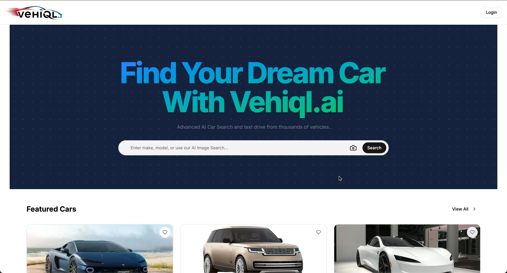
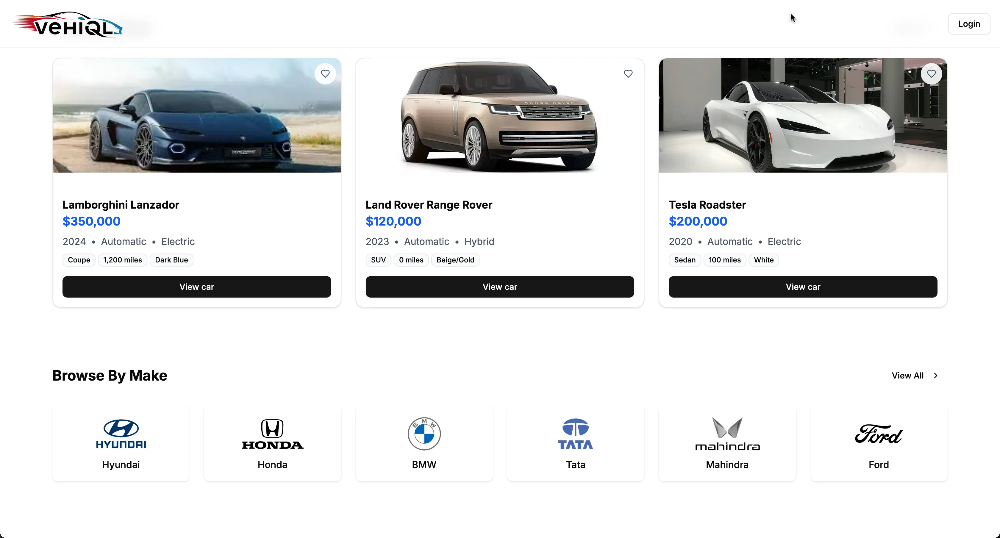
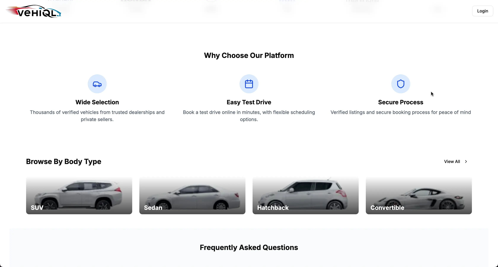
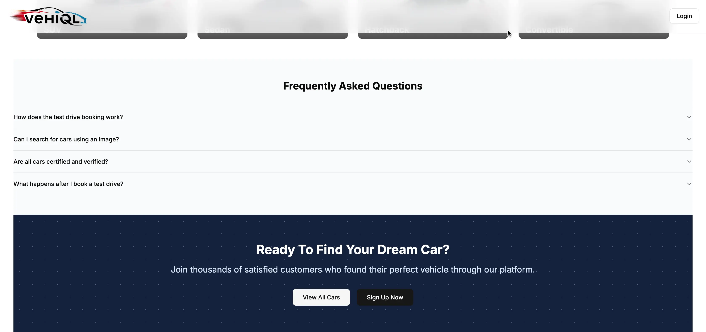

# 🚗 Vehiql – Car Marketplace App

**Vehiql** is an AI-powered car marketplace web application designed to help users search, compare, and book test drives for their dream cars — all from a sleek, modern interface. Built using the MERN stack, Vehiql combines intelligent filtering with real-time data and a user-friendly experience.

---

## 🧠 Key Features

- 🔍 **AI-Powered Car Discovery**  
  Smart filtering system that adapts to user preferences such as price, fuel type, year, brand, and more. Results become more relevant as the system learns user behavior.

- 🚘 **Detailed Car Listings**  
  Each listing contains specs, features, HD images, and key comparison info. Filters include brand, model, fuel type, transmission, and price range.

- 📅 **Book Test Drives Instantly**  
  Integrated calendar interface lets users book test drives at selected dealerships in real time.

- ❤️ **Wishlist and Compare**  
  Users can save cars to their personal wishlist and compare multiple vehicles side-by-side.

- 📍 **Location-Based Dealership Discovery**  
  Shows dealerships or sellers near the user using Google Maps integration, custom pins, and address filters.

- 🧾 **Admin Dashboard (Optional)**  
  Admin can add/edit car listings, manage bookings, and monitor user activity (if included).

---

## 📸 Screenshots

### 🔍 Home Screen  


### 🧠 AI-Powered Search  


### 🚘 Car Details Page  


### 📅 Test Drive Booking  


---

## 🛠 Tech Stack

| Layer        | Technology                                   |
|--------------|-----------------------------------------------|
| **Frontend** | React.js, Tailwind CSS, React Router          |
| **State**    | Redux Toolkit / Context API                   |
| **Backend**  | Node.js, Express.js                           |
| **Database** | MongoDB Atlas (Cloud DB)                      |
| **Auth**     | Firebase Authentication / JWT (for admin)     |
| **AI Logic** | Custom filtering engine using JS/ML rules     |
| **Others**   | Google Maps API, Cloudinary (for image upload), Stripe (optional) |

---

## 🚀 How to Run Locally

### 🔧 Frontend
```bash
cd vehiql-client
npm install
npm start

### 🔧 Backend
```bash
cd vehiql-server
npm install
npm run dev


### 🔧 👨‍💻 Developed by
Muhammad Umer Baig
React Native | MERN Stack Developer
📧 umerbaig1125@gmail.com
🌐 Portfolio: https://my-portfolio-khaki-two-96.vercel.app/ 
💼 LinkedIn: https://www.linkedin.com/in/umer-baig-435206126/

